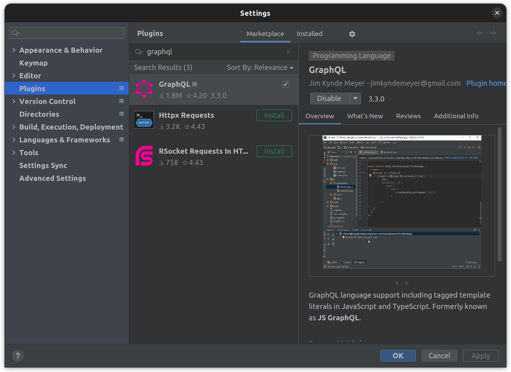
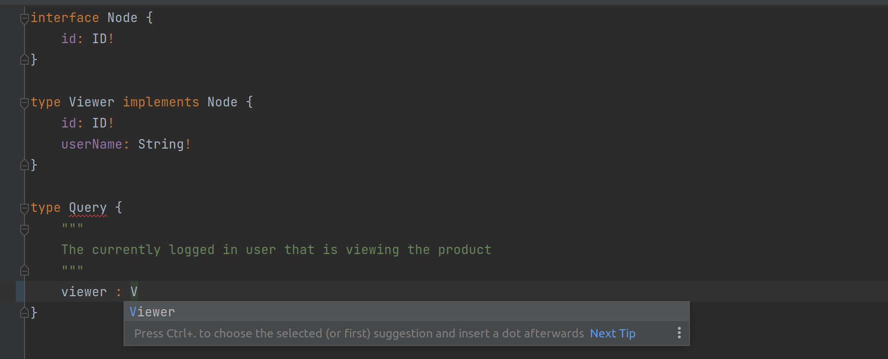
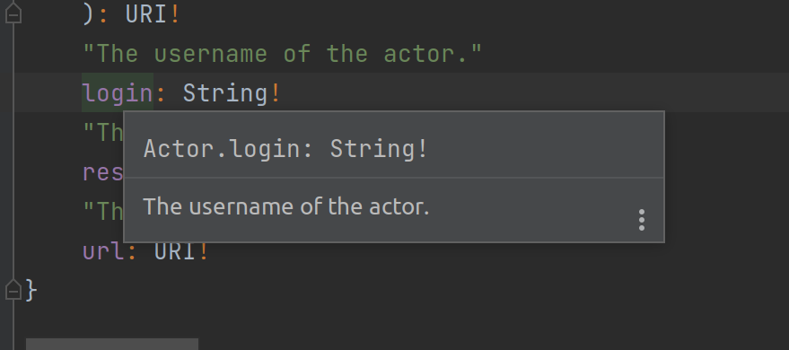
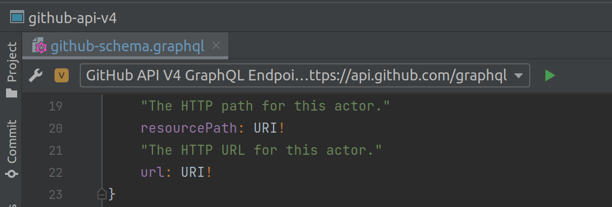
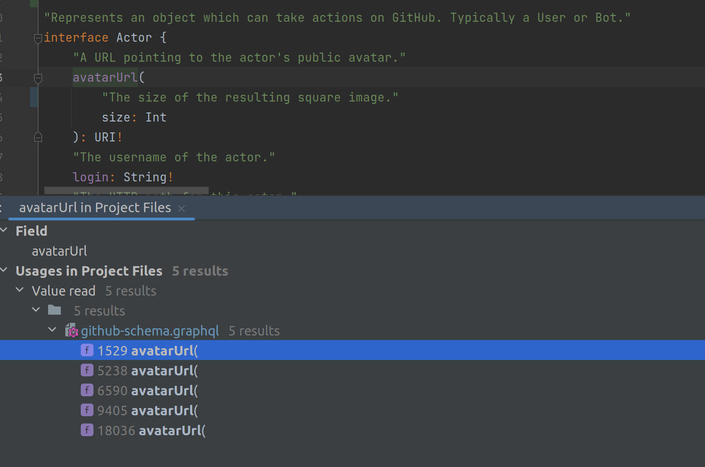
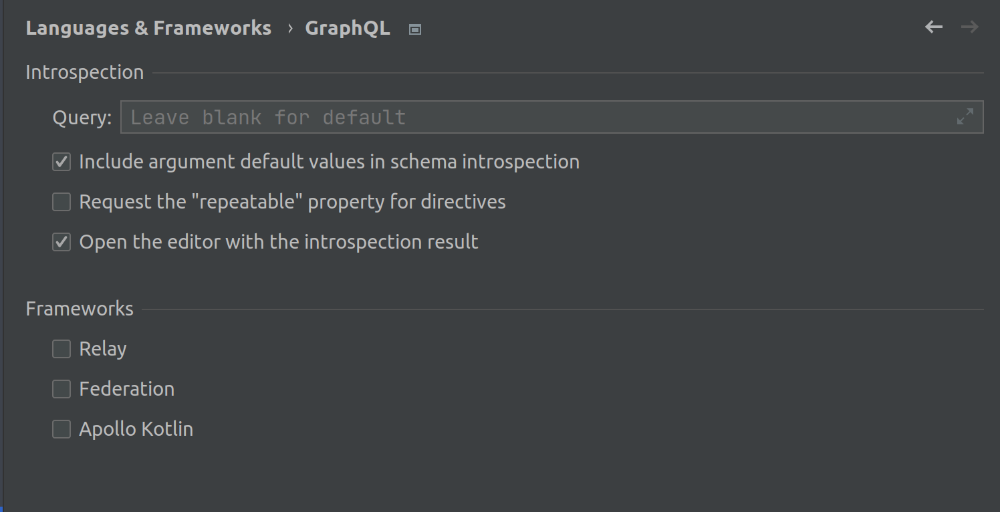
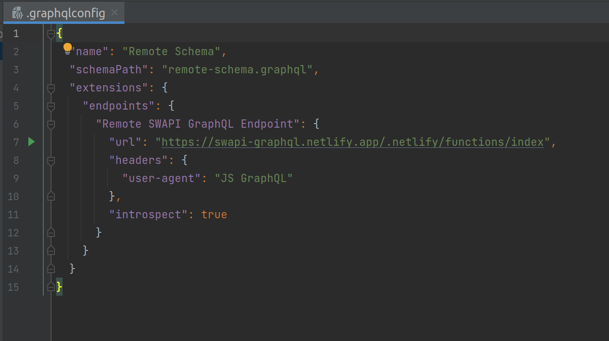

# GraphQL IntelliJ Plugin
GraphQL language support for [WebStorm](https://www.jetbrains.com/webstorm/), [IntelliJ IDEA](https://www.jetbrains.com/idea/) and other [IDEs based on the IntelliJ Platform](https://www.jetbrains.com/products/#type=ide). The plugin works with all IDEs in the IntelliJ Platform.

## Prerequisites & Installation
### Prerequisites
The plugin and this documentation assume you are already familiar with the GraphQL language. If you're not, please visit the official [graphql.org](https://graphql.org/) website first.
The plugin works out of the box with popular GraphQL clients such as [Apollo GraphQL](https://www.apollographql.com/) and [Relay](https://facebook.github.io/relay/), but you're free to choose your client and server frameworks.
### Installation
The plugin is published to the [JetBrains Plugin Repository](https://plugins.jetbrains.com/plugin/8097-js-graphql).
You can install it directly from your IDE via the `File | Settings/Preferences | Plugins` screen.
On the `Marketplace` tab simply search for `graphql` and select the `GraphQL` suggestion:


## Developer guide
This developer guide covers how to setup your project to get the most out of the GraphQL language tooling in this plugin.

The main features of the plugin are:
- Full language support for GraphQL Specification including the Schema Definition Language (SDL)
- Schema-aware completion, error highlighting, code-formatting, folding, commenter, and brace-matching and documentation

  

  
- The plugin [discovers your local schema](#project-structure-and-schema-discovery) on the fly. Remote schemas are easily fetched using introspection. Introspect GraphQL endpoints to generate schema declaration files using the GraphQL Type System Definition Language
- Support for [multi-schema projects](#setting-up-multi-schema-projects-using-graphql-config) using configurable project scopes or graphql-config files Schema discovery is configured using [graphql-config v2](https://github.com/kamilkisiela/graphql-config/tree/legacy) files, including support for multi-schema projects
- Built-in support for [Relay](https://facebook.github.io/relay/) and [Apollo](https://www.apollographql.com/) projects: `graphql` and `gql` tagged template literals in JavaScript and TypeScript are automatically recognized as GraphQL
- Execute queries using variables against configurable endpoints, including support for custom headers and environment variables

  
- `Find Usages` and `Go to Declaration` for schema types, fields, and fragments

  
- `Structure view` to navigate GraphQL files
- Load variables from shell or `.env` files. Supported file names: `.env.local`,`.env.development.local`,`.env.development`,`.env.dev.local`,`.env.dev`,`.env`
- Built-in Relay and Apollo Federation type definitions (You need to enable it in settings)

  

The most important aspect of using the plugin is to configure how schema types are discovered. If the schema types are not discovered correctly, language features such as completion and error highlighting will be based on the wrong type information.

Schemas and their types are declared using GraphQL Type System Definition Language which is also widely known as GraphQL Schema Definition Language (often abbreviated as SDL).
If you're authoring your schemas in SDL, the plugin provides the following features:
- Completion on types when defining fields, arguments, implemented interfaces etc.
- Error highlighting of schema errors such as unknown types, wrong use of types, missing fields when implementing interfaces
- Find usages in SDL and refactoring such as rename which will update the relevant queries, mutations etc.

For use cases where you don't declare the schema in the project, an introspection query can be executed against a GraphQL endpoint URL to write the schema to a .graphql file as SDL. See Working with GraphQL Endpoints.
## Project Structure and Schema Discovery
By default, the plugin assumes that your project only contains a single schema. If this is the case, you don't need to take any action in terms of schema discovery. For a single-schema project, schema types are discovered as follows:
All `.graphql` files in the "Project files" scope are processed for type definitions which are added to a singleton type registry
If the IDE has JavaScript language support, injected GraphQL strings in the "Project files" scope are processed for all JavaScript file types. File extensions include `.js`, `.jsx`, `.ts`, and `.tsx`. Injected GraphQL is found based on Tagged Template Literals with one of the following tags: `graphql`, `.gql`, and `Relay.QL`.

For projects with multiple schemas, developers have to configure a scope for each schema. The purpose of a schema-specific scope is to prevent types from being picked up in more than one GraphQL type registry, which would likely result in validation errors as types appear to have been declared more than once. In addition, the scopes prevent non-conflicting types from showing up in completions and ensure that validation only recognizes the types that belong to the current schema.
The plugin allows you to configure your schema scopes using graphql-config v2 configuration files with `includes` and `excludes` glob patterns
### Setting up Multi-schema Projects using graphql-config
Please familiarize yourself with the [graphql-config v2](https://github.com/kamilkisiela/graphql-config/tree/legacy/specification.md) format before proceeding.
The next step is to decide where to place the `.graphqlconfig` file. The config file controls schema discovery from the directory it's placed in, as well as any sub folders that don't have their own .graphqlconfig.
To create a `.graphqlconfig` file, right-click a folder and select "New GraphQL Configuration File" or use the "+" Button in the GraphQL Tool window tab called "Schemas and Project Structure".
Depending on your preference, you can use a single `.graphqlconfig` file in a folder that is a parent to each schema folder, or you can place .graphqlconfig files in each schema folder.

**Option A**: Multiple config files (recommended):
```
- project root/
    - product a (schema one)/
        - .graphqlconfig <-----
        - schema files and graphql aware components
    - product b (schema two)/
        - .graphqlconfig <-----
        - schema files and graphql aware components
```

With this approach the location of the config files creates separate scopes for the two schemas.

**Option B**: Single config file:
```
- project root/
    - .graphqlconfig <-----
    - product a (schema one)/
        - schema files and graphql aware components
    - product b (schema two)/
        - schema files and graphql aware components
```

With a single config file you need to separate the schemas using the includes globs of the projects field:
```json
{
  "projects": {
    "product a": {
      "includes": ["product a (schema one)/**"]
    },
    "product b": {
      "includes": ["product b (schema two)/**"]
    }
  }
}
```

See https://github.com/jimkyndemeyer/graphql-config-examples for example uses of `.graphqlconfig` to control schema discovery.

## Working with GraphQL Endpoints and Scratch Files
You can use GraphQL scratch files to work with your schema outside product code, e.g. by writing temporary queries to test resolvers.
To run queries or mutations against your GraphQL endpoint, add your endpoint details to a `.graphqlconfig` file. If you don't already have a config file, you can create one by right-clicking on your project base dir and choosing "New" - "GraphQL Configuration File". If you already have a config file, you can jump to it using the "Edit .graphqlconfig" toolbar button in the top left side of the scratch file editor.
See https://github.com/kamilkisiela/graphql-config/tree/legacy#specifying-endpoint-info for the expected format of endpoint details such as the URL, headers etc.

The following example is from graphql-config-examples/remote-schema-introspection
It demonstrates how to use the endpoints configured in `.graphqlconfig` to fetch an existing remote schema.


With `introspect: true` the plugin asks at project startup whether to update the local schema using the configured endpoint.

The update works by sending an introspection query to the endpoint, and then writing the result to the configured schemaPath.

Introspection queries can also be executed by double-clicking endpoints in the schemas tree view:


Notes and comments:
- If you're both developing the server schema and consuming it in a client, e.g. via component queries, you'll get the best tooling by having your schema expressed using GraphQL Schema Definition Language directly in your project. With that setup the plugin immediately discovers your schema, and you don't have to perform an introspection after server schema changes.
- Tip: The re-run introspection action can be bound to a keyboard shortcut for convenience

## Injections

### Tagged template literals

Supported tags are: `graphql`, `gql`, `Relay.QL`, `Apollo.gql`.
```
const QUERY = gql``;
```

### IntelliJ default comment-based injection

```
// language=GraphQL
const QUERY = `query { field }`;
```

### C-style comments
```
const QUERY = /* GraphQL */ `query { field }`;
```

### GraphQL comments
```js
const QUERY = `
    #graphql
    
    query { field }
`;
```


## Acknowledgements
This plugin was heavily inspired by [GraphiQL](https://github.com/graphql/graphiql) from Facebook.

A number of language features such as query and schema validation are powered by [graphql-java](https://github.com/graphql-java/graphql-java).

A thanks also goes out to the [Apollo](https://github.com/apollographql) and [Prisma](https://github.com/prisma) teams for their continued efforts to improve the GraphQL Developer Experience.

And finally, a thank you to the [JetBrains WebStorm team](https://twitter.com/WebStormIDE) and the Alpha/Beta testers for all their help.
## License
MIT


